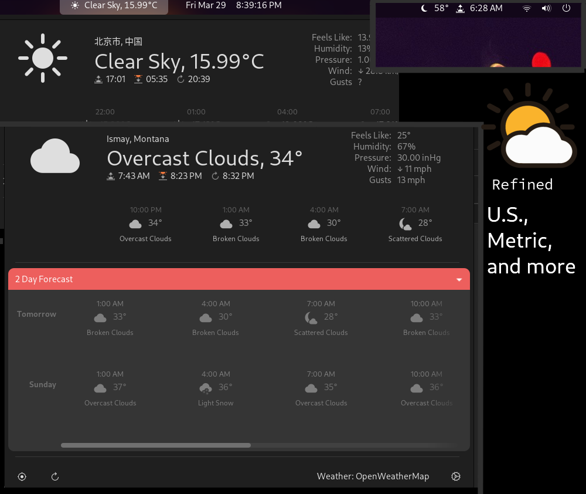

# OpenWeather

[](./openweather-screenshot.png)

OpenWeather (*gnome-shell-extension-openweather*) is a simple extension for
displaying weather conditions and forecasts for any location on Earth in the
GNOME Shell. It provides support for multiple locations with editable names
using coordinates to store the locations, a beautiful layout, and more.

Weather data is fetched from [OpenWeatherMap](https://openweathermap.org)
including 3 hour forecasts for up to 5 days.

## v123

- GNOME 45 Support (from Kenneth Topp's fork)
- Simplify unnecessarily long names (e.g. 'Savannah, Chatham County, Georgia, United States' -> 'Savnnah, Georgia')
- Making 'Loading' message '...' since it was sometimes way too long
- Fix "Weather Data By..." URL not opening website
- Fix weird errors that happen sometimes when deleting a location
- Fix location look-up forever "pretending" to be searching with no Internet

## Installation

After completing one of the installation methods below, restart GNOME Shell
(*Xorg: `Alt`+`F2`, `r`, `Enter` - Wayland: `log out` or `reboot`*) and
enable the extension through the *gnome-extensions* app.

### Install From Source

This method installs to your `~/.local/share/gnome-shell/extensions` directory
from the latest source code on the `master` branch.

First make sure you have the following dependencies installed:

| Arch-Based     | Debian-Based                  | Fedora                 |
| ---            | ---                           | ---                    |
| `dconf`        | `dconf-gsettings-backend`     | `dconf`                |
| `gnome-shell`  | `gnome-shell-extension-prefs` | `gnome-extensions-app` |
| `git`          | `git`                         | `git`                  |
| `base-devel`   | `build-essential`             | `glib2-devel`          |
|                | `gettext`                     | `gettext-devel`        |
|                | `libsoup3`                    |                        |

Then run the following commands:

```
git clone https://github.com/penguin-teal/gnome-openweather.git

cd gnome-openweather

git switch --detach latest

make && make install
```

## Bugs

Bugs should be reported
[here](https://github.com/penguin-teal/gnome-openweather/issues)
on the GitHub issues page.

When submitting a bug report, please make sure to provide as much information
as you can about the issue, your Linux distribution, GNOME Shell version,
and OpenWeather (*gnome-shell-extension-openweather*) version.

## Credits

This project is a fork of Kenneth Topp's fork of Jason Oickle's fork of the
original OpenWeather extension by @jenslody. See [`AUTHORS`](./AUTHORS)
for previous contributor details.

### Translations

Special thanks to the following people for updating translation `*.po` files
via merge requests:

French: @franckgaga | Slovak: @jose1711 | Chinese: @xiaozhangup & @zyw271828 |
Portuguese: @ronaldocosta | Russian: @vantu5z & @tvaliiev | Czech: @lev741 |
Turkish: @oguzkarayemis | German: @zeners | Polish: @MarcinScieszka |
Italian: @alealetti

### Icons

OpenWeather's icon was designed by [Sihan Liu](https://www.sihanliu.com) and
licensed under the [CC-BY-SA](http://creativecommons.org/licenses/by-sa/3.0/)
license.

Packaged weather icons are sourced from the
[GNOME Project](http://www.gnome.org)'s
[Adwaita Icon Theme](https://gitlab.gnome.org/GNOME/adwaita-icon-theme)
under the GPLv3 license.

### License

OpenWeather is free software available under the terms of the GPLv3 license.
See [`COPYING`](./COPYING) for details.

